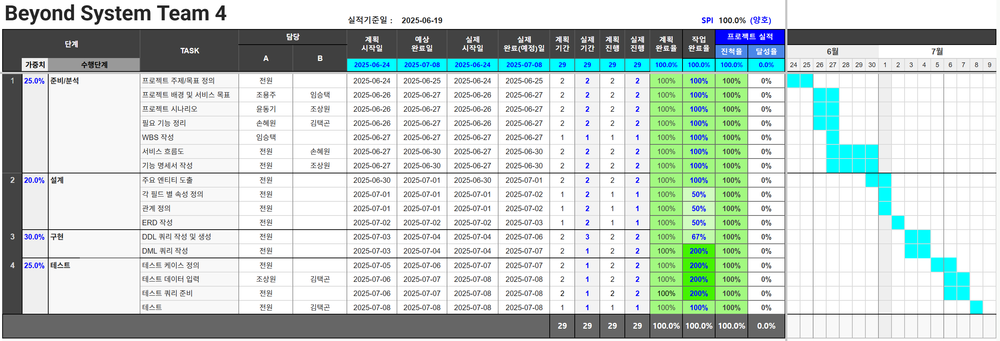
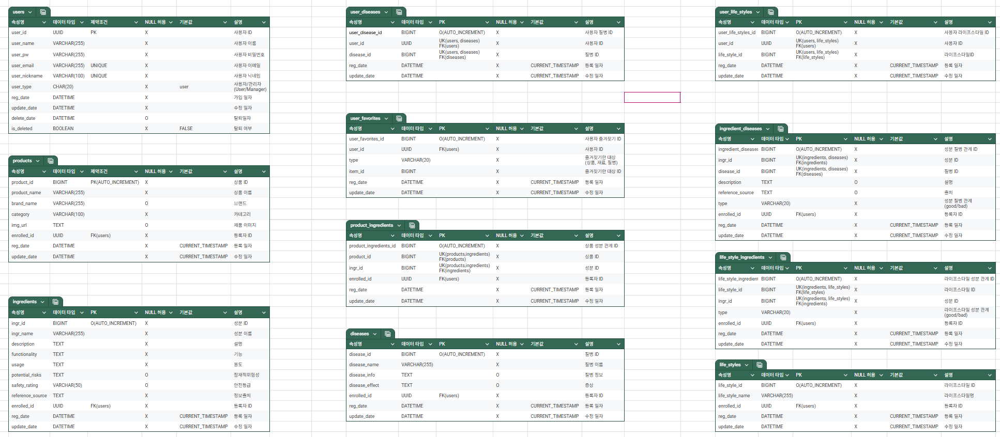

# 

## 👀목차
1. [팀원](#팀원)
2. [프로젝트 개요](#프로젝트-개요)  
	2.1 [💡배경](#배경)  
	2.2 [🎯서비스 목표](#서비스-목표)  
3. [📅WBS](#WBS)
4. [📄프로젝트 기획서](#프로젝트-기획서)
5. [🎬프로젝트 시나리오](#프로젝트-시나리오)  
6. [📘요구사항 명세서](#요구사항-명세서)  
7. [🗃️테이블 명세서](#테이블-명세서)
8. [📊ERD](#ERD)
9. [SQL](#SQL)
---
### 팀원

| 김택곤 | 손혜원 | 윤동기 | 임승택 | 조상원 | 조용주 |
| --- | --- | --- | --- | --- | --- |
|     |   |  | | |  |
|<a href="" target="_blank"></a> | <a href="https://github.com/sonhyee" target="_blank"></a> | <a href="https://github.com/ydg010" target="_blank"></a> | <a href="https://github.com/lst405656" target="_blank"></a> | <a href="https://github.com/sangwon5579" target="_blank"></a> | <a href="https://github.com/whwjyj" target="_blank"></a> |


---

### 프로젝트 개요
---
#### 💡배경
현대 사회는 다양한 가공식품과 수많은 종류의 화장품, 생활용품으로 가득합니다. 소비자들은 편리함 속에서 매일 새로운 제품을 접하지만, 동시에 이 제품들이 어떤 성분으로 이루어져 있는지, 내 몸과 피부에 어떤 영향을 미칠지에 대한 정보는 턱없이 부족합니다. 복잡하고 전문적인 원재료명이나 성분표는 일반 소비자들이 이해하기 어렵고, 이로 인해 특정 성분 알레르기 발생, 건강 악화, 피부 트러블 등 예상치 못한 부작용을 겪는 경우가 빈번하게 발생하고 있습니다.  
 (출처: [https://news.sbs.co.kr/news/endPage.do?news_id=N1007619182](https://news.sbs.co.kr/news/endPage.do?news_id=N1007619182))  

 (출처: [https://www.ohmynews.com/NWS_Web/View/at_pg.aspx?CNTN_CD=A0002876991](https://www.ohmynews.com/NWS_Web/View/at_pg.aspx?CNTN_CD=A0002876991))


특히, 제로 슈가, 제로 칼로리 등 건강에 대한 관심이 높아지면서 특정 알레르기를 가진 사람뿐만 아니라 임산부, 영 유아 부모, 만성질환자 등 성분 선택에 민감한 취약 계층, 그리고 자신의 건강 목표(다이어트, 피부 관리 등)나 라이프 스타일(비건, 유기농 선호)에 맞춰 제품을 선택하려는 일반 소비자들 사이에서 '내가 사용하는 제품 속 성분'에 대한 투명하고 신뢰할 수 있는 정보의 중요성이 더욱 커지고 있습니다. 이러한 정보의 불균형은 소비자의 현명한 선택을 방해하고, 불필요한 불안감을 증폭 시키는 주요 원인이 되고 있습니다.  

---
#### 🎯서비스 목표

사용자가 섭취하거나 피부에 사용하는 **모든 제품의 원재료명 및 성분표를 손쉽게 확인**하고, 이를 바탕으로 안전하고 건강한 소비를 스스로 결정할 수 있도록 돕는 것이 서비스 목표입니다. 

---
##### 👤개인 맞춤형 성분 정보 제공
 사용자가 등록한 알레르기 유발 성분을 즉각적으로 파악하고 경고하는 것을 넘어, 사용자의 건강 목표와 라이프스타일에 최적화된 성분 정보를 제공합니다. 이를 통해 단순히 유해 성분을 피하는 것을 넘어, 건강에 도움이 되는 성분은 적극적으로 선택할 수 있도록 돕습니다.
##### 🔍성분 정보의 대중화 및 신뢰성 확보
 복잡하고 전문적인 성분 정보를 누구나 쉽게 이해할 수 있는 언어로 풀어내어 제공하고, 공신력 있는 데이터를 기반으로 신뢰할 수 있는 정보만을 전달합니다. 이를 통해 소비자가 제품 성분에 대한 호기심을 해소하고, 스스로 정보를 학습하며 현명한 소비자로 성장하도록 지원합니다.
##### 🌱건강하고 안전한 소비 환경 조성
 편의점 식품부터 화장품, 생활용품에 이르기까지 일상 속 다양한 제품의 성분 투명성을 높여, 소비자들이 불필요하거나 유해할 수 있는 성분을 피하고 건강한 성분을 선택할 수 있는 안전한 소비 환경 조성에 기여합니다.  

---

### [📅WBS](https://docs.google.com/spreadsheets/d/1ywVBV67NrzWV-1znNUS8sd5j1ng35hN3S3RMZ7b0pGk/edit?gid=509945759#gid=509945759)
  

---

### [📅프로젝트 기획서 사회는 다양한 가공식품과 수많은 종류의 화장품, 생활용품으로 가득합니다. 소비자들은 편리함 속에서 매일 새로운 제품을 접하지만, 동시에 이 제품들이 어떤 성분으로 이루어져 있는지, 내 몸과 피부에 어떤 영향을 미칠지에 대한 정보는 턱없이 부족합니다. 복잡하고 전문적인 원재료명이나 성분표는 일반 소비자들이 이해하기 어렵고, 이로 인해 특정 성분 알레르기 발생, 건강 악화, 피부 트러블 등 예상치 못한 부작용을 겪는 경우가 빈번하게 발생하고 있습니다.  
 (출처: [https://news.sbs.co.kr/news/endPage.do?news_id=N1007619182](https://news.sbs.co.kr/news/endPage.do?news_id=N1007619182))  

 (출처: [https://www.ohmynews.com/NWS_Web/View/at_pg.aspx?CNTN_CD=A0002876991](https://www.ohmynews.com/NWS_Web/View/at_pg.aspx?CNTN_CD=A0002876991))


특히, 제로 슈가, 제로 칼로리 등 건강에 대한 관심이 높아지면서 특정 알레르기를 가진 사람뿐만 아니라 임산부, 영 유아 부모, 만성질환자 등 성분 선택에 민감한 취약 계층, 그리고 자신의 건강 목표(다이어트, 피부 관리 등)나 라이프 스타일(비건, 유기농 선호)에 맞춰 제품을 선택하려는 일반 소비자들 사이에서 '내가 사용하는 제품 속 성분'에 대한 투명하고 신뢰할 수 있는 정보의 중요성이 더욱 커지고 있습니다. 이러한 정보의 불균형은 소비자의 현명한 선택을 방해하고, 불필요한 불안감을 증폭 시키는 주요 원인이 되고 있습니다.  

---
#### 🎯서비스 목표

사용자가 섭취하거나 피부에 사용하는 **모든 제품의 원재료명 및 성분표를 손쉽게 확인**하고, 이를 바탕으로 안전하고 건강한 소비를 스스로 결정할 수 있도록 돕는 것이 서비스 목표입니다. 

---
##### 👤개인 맞춤형 성분 정보 제공
 사용자가 등록한 알레르기 유발 성분을 즉각적으로 파악하고 경고하는 것을 넘어, 사용자의 건강 목표와 라이프스타일에 최적화된 성분 정보를 제공합니다. 이를 통해 단순히 유해 성분을 피하는 것을 넘어, 건강에 도움이 되는 성분은 적극적으로 선택할 수 있도록 돕습니다.
##### 🔍성분 정보의 대중화 및 신뢰성 확보
 복잡하고 전문적인 성분 정보를 누구나 쉽게 이해할 수 있는 언어로 풀어내어 제공하고, 공신력 있는 데이터를 기반으로 신뢰할 수 있는 정보만을 전달합니다. 이를 통해 소비자가 제품 성분에 대한 호기심을 해소하고, 스스로 정보를 학습하며 현명한 소비자로 성장하도록 지원합니다.
##### 🌱건강하고 안전한 소비 환경 조성
 편의점 식품부터 화장품, 생활용품에 이르기까지 일상 속 다양한 제품의 성분 투명성을 높여, 소비자들이 불필요하거나 유해할 수 있는 성분을 피하고 건강한 성분을 선택할 수 있는 안전한 소비 환경 조성에 기여합니다.  

---

### [📅WBS](https://docs.google.com/spreadsheets/d/1ywVBV67NrzWV-1znNUS8sd5j1ng35hN3S3RMZ7b0pGk/edit?gid=509945759#gid=509945759)
  

---

### [📄프로젝트 기획서](https://docs.google.com/document/d/1dea6-qKtYOETbKuGAM2aO-TD-QRYQuiLapuRkPCAjp8/edit?usp=sharing)

---

### 🎬프로젝트 시나리오
  

---

### [📘요구사항 명세서](https://docs.google.com/spreadsheets/d/1ywVBV67NrzWV-1znNUS8sd5j1ng35hN3S3RMZ7b0pGk/edit?gid=433577389#gid=433577389)
  

---

### [🗃️테이블 명세서](https://docs.google.com/spreadsheets/d/1ywVBV67NrzWV-1znNUS8sd5j1ng35hN3S3RMZ7b0pGk/edit?gid=2018217042#gid=2018217042)
  

---
### 📊ERD
  

---
### SQL

<details>
	<summary>DML</summary>

#### 사용자 테이블
```SQL
CREATE TABLE `users`(
	`user_id` UUID DEFAULT UUID() COMMENT '사용자 고유 ID',
	`user_name` VARCHAR(255) NOT NULL COMMENT '사용자 이름',
	`user_pw` VARCHAR(255) NOT NULL COMMENT '사용자 비밀번호',
	`user_email` VARCHAR(255) NOT NULL COMMENT '사용자 이메일',
	`user_nickname` VARCHAR(100) NOT NULL COMMENT '사용자 닉네임', 
	`user_type` CHAR(20) NOT NULL DEFAULT 'user' COMMENT '사용자 유형(user/manager)',
	`reg_date` DATETIME NOT NULL DEFAULT CURRENT_TIMESTAMP COMMENT '가입 일자',
	`update_date` DATETIME NOT NULL DEFAULT CURRENT_TIMESTAMP ON UPDATE CURRENT_TIMESTAMP COMMENT '수정 일자',
	`delete_date` DATETIME COMMENT '탈퇴 일자',
	`is_deleted` BOOLEAN NOT NULL DEFAULT FALSE COMMENT '탈퇴 여부',
	
	-- 제약 조건
	CONSTRAINT PRIMARY KEY (user_id),
	CONSTRAINT uq_user_email UNIQUE (user_email),
	CONSTRAINT uq_user_nickname UNIQUE (user_nickname),
	CONSTRAINT chk_user_type CHECK (`user_type` IN ('user', 'manager'))
);

```
</details>


<details>
	<summary>DDL</summary>

#### 회원가입 (요구사항 코드: member-001)
```SQL
INSERT INTO users
(user_id, user_name, user_pw, user_email, user_nickname, reg_date, update_date)
VALUES (UUID(), '이름', '비밀번호', '이메일', '닉네임', NOW(), NOW());
```

#### 로그인 (요구사항 코드: member-002)
```SQL
SELECT user_email,
       user_pw
FROM users
WHERE user_email = '이메일' 
	AND user_pw = '비밀번호'
	AND is_deleted = FALSE;
```

#### 회원정보수정 (요구사항 코드: member-004)
##### 이메일 변경
```SQL
UPDATE users 
SET user_email = '변경할 이메일' 
WHERE user_email = '이메일' 
      AND user_pw = '비밀번호' 
      AND is_deleted = FALSE;
```

##### 비밀번호 변경
```SQL
UPDATE users 
SET user_pw = '변경할 비밀번호' 
WHERE user_email = '이메일' 
      AND user_pw = '비밀번호' 
      AND is_deleted = FALSE;
```

##### 질병 정보 변경
```SQL
UPDATE user_diseases
SET disease_id = '변경할 질병 ID' 
WHERE user_id = '사용자 ID'
      AND disease_id = '변경하고 싶은 질병 ID';
```
```SQL
SELECT user_name AS '이름',
       disease_name AS '변경된 질병명',
       disease_info AS '변경된 질병 정보',
       disease_effect AS '변경된 질병 효과'
FROM users u  
INNER JOIN user_diseases u_d   
ON u.user_id = u_d.user_id
INNER JOIN diseases d  
ON d.disease_id = u_d.diseases_id
WHERE user_id = '사용자 ID';
```

##### 즐겨찾기 변경
```SQL
UPDATE user_favorites
SET item_id = '변경할 즐겨찾기 대상 ID'
WHERE user_id = '사용자 ID'
      AND item_id = '변경하고 싶은 즐겨찾기 대상 ID';
```
```SQL
SELECT user_name AS '이름',
       item_id AS '변경된 즐겨찾기한 대상 아이템 ID',
       `type` AS '변경된 즐겨찾기 대상'
FROM users u
INNER JOIN user_favorites u_f  
ON u.user_id = u_f.user_id
WHERE u.user_id = '사용자 ID';
```

##### 성향 변경
```SQL
UPDATE user_life_styles
SET life_style_id = '변경할 라이프스타일 ID'
WHERE user_id = '사용자 ID'
      AND life_style_id = '변경하고 싶은 라이프스타일 ID';
```
```SQL
SELECT user_name AS '이름',
       life_style_name AS '변경된 라이프스타일'
FROM users u 
INNER JOIN user_life_styles u_l  
ON u.user_id = u_l.user_id  
INNER JOIN life_styles l  
ON l.life_style_id = u_l.life_style_id   
WHERE user_id = '사용자 ID';
```

#### 회원 탈퇴 (요구사항 코드 : member-005)
``` SQL
UPDATE `users`
SET `is_deleted` = TRUE,
    `delete_date` = CURRENT_TIMESTAMP
WHERE `user_id` = '' AND `is_deleted` = FALSE;
```

#### 회원 등록 정보 조회 (요구사항 코드 : member-006)
``` SQL
SELECT u.user_id,
       d.disease_name,
       l.life_style_name
FROM users u
INNER JOIN user_disease u_d
	ON u.user_id = u_d.user_id 
INNER JOIN disease d
	ON u_d.diseases_id = d.disease_id
INNER JOIN user_life_styles u_l
	ON u.user_id = u_l.user_id
INNER JOIN life_styles l
	ON u_l.life_style_id = l.life_style_id
WHERE user_id = 'input_id';
```

#### 회원 관심 상품 / 재료 / 질병 조회 (요구사항 코드 : member-007)
``` SQL
SELECT f.user_id,
       f.type,
       p.product_name
FROM user_favorites f
INNER JOIN products p
	ON f.item_id = p.product_id
WHERE f.user_id = 'input_id';

SELECT f.user_id,
       f.type,
       i.ingr_name
FROM user_favorites f
INNER JOIN ingredient i
	ON f.item_id = i.ingr_id
WHERE f.user_id = 'input_id';

SELECT f.user_id,
       f.type,
       d.disease_name
FROM user_favorites f
INNER JOIN diseases d
	ON f.item_id = d.disease_id
WHERE f.user_id = 'input_id';
```

#### 질환 검색 (요구사항 코드 : disease-001,002,003)
```SQL
SELECT d.disease_info,
		 d.disease_effect,
		 d.precautions,
		 ind.type,
		 i.ingr_name
FROM disease d 
LEFT JOIN ingredient_disease ind
	ON ind.disease_id = d.disease_id
LEFT JOIN ingredient i
	ON i.ingr_id = ind.ingr_id
WHERE disease_name LIKE '%암%';
```

#### 위험 표시 (요구사항 코드 : user-product-001)
```SQL
SELECT i.description,
	   i.safety_rating
from ingredient i
LEFT JOIN ingredient_disease id 
	ON id.ingr_id = i.ingr_id
LEFT JOIN user_disease ud 
	ON ud.disease_id = id.disease_id
LEFT JOIN users u 
	ON u.user_id = ud.user_id
WHERE users = '유저 아이디';
```

#### 사용자 라이프 스타일 위험 표시 (요구사항 코드 : user-product-002)
```SQL
SELECT l.life_style_name , 
	   lsi.`type`
from life_style l
LEFT JOIN life_style_ingredient lsi 
	ON lsi.life_style_ingr_id = l.life_style_id
LEFT JOIN user_life_style uls 
	ON uls.life_style_id = l.life_style_id
LEFT JOIN users u 
	ON u.user_id = uls.user_id
WHERE users = '유저 아이디';
```

#### 추천 (요구사항 코드 : user-product-003)
```SQL
SELECT l.life_style_name,
	   i.ingr_name, 
	    `type` 
FROM life_style l
LEFT JOIN life_style_ingredient lsi 
	ON lsi.life_style_id = l.life_style_id
LEFT JOIN ingredient i 
	ON i.ingr_id = lsi.ingr_id
LEFT JOIN user_life_style uls 
	ON uls.life_style_id = l.life_style_id
LEFT JOIN users u 
	ON u.user_id = uls.user_id
WHERE users = '유저 아이디';
```
</details>
