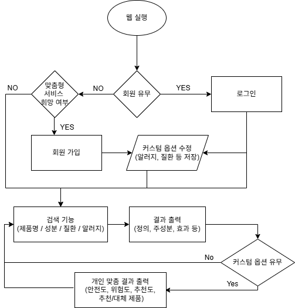

# 

## 👀목차
1. [👥팀원](#팀원)
2. [📚프로젝트 개요](#프로젝트-개요)  
	2.1 [💡배경](#배경)  
	2.2 [🎯서비스 목표](#서비스-목표)  
3. [📅WBS](#WBS)
4. [📄프로젝트 기획서](#프로젝트-기획서)
5. [🎬프로젝트 시나리오](#프로젝트-시나리오)  
6. [📘요구사항 명세서](#요구사항-명세서)  
7. [🗃️테이블 명세서](#테이블-명세서)
8. [📊ERD](#ERD)
9. [💾SQL](#SQL)
---
### 👥팀원

| 김택곤 | 손혜원 | 윤동기 | 임승택 | 조상원 | 조용주 |
| --- | --- | --- | --- | --- | --- |
|     |   |  | | |  |
|<a href="" target="_blank"></a> | <a href="https://github.com/sonhyee" target="_blank"></a> | <a href="https://github.com/ydg010" target="_blank"></a> | <a href="https://github.com/lst405656" target="_blank"></a> | <a href="https://github.com/sangwon5579" target="_blank"></a> | <a href="https://github.com/whwjyj" target="_blank"></a> |


---

### 📚프로젝트 개요
---
#### 💡배경
현대 사회는 다양한 가공식품과 수많은 종류의 화장품, 생활용품으로 가득합니다. 소비자들은 편리함 속에서 매일 새로운 제품을 접하지만, 동시에 이 제품들이 어떤 성분으로 이루어져 있는지, 내 몸과 피부에 어떤 영향을 미칠지에 대한 정보는 턱없이 부족합니다. 복잡하고 전문적인 원재료명이나 성분표는 일반 소비자들이 이해하기 어렵고, 이로 인해 특정 성분 알레르기 발생, 건강 악화, 피부 트러블 등 예상치 못한 부작용을 겪는 경우가 빈번하게 발생하고 있습니다.  
 (출처: [https://news.sbs.co.kr/news/endPage.do?news_id=N1007619182](https://news.sbs.co.kr/news/endPage.do?news_id=N1007619182))  

 (출처: [https://www.ohmynews.com/NWS_Web/View/at_pg.aspx?CNTN_CD=A0002876991](https://www.ohmynews.com/NWS_Web/View/at_pg.aspx?CNTN_CD=A0002876991))


특히, 제로 슈가, 제로 칼로리 등 건강에 대한 관심이 높아지면서 특정 알레르기를 가진 사람뿐만 아니라 임산부, 영 유아 부모, 만성질환자 등 성분 선택에 민감한 취약 계층, 그리고 자신의 건강 목표(다이어트, 피부 관리 등)나 라이프 스타일(비건, 유기농 선호)에 맞춰 제품을 선택하려는 일반 소비자들 사이에서 '내가 사용하는 제품 속 성분'에 대한 투명하고 신뢰할 수 있는 정보의 중요성이 더욱 커지고 있습니다. 이러한 정보의 불균형은 소비자의 현명한 선택을 방해하고, 불필요한 불안감을 증폭 시키는 주요 원인이 되고 있습니다.  

---
#### 🎯서비스 목표

사용자가 섭취하거나 피부에 사용하는 **모든 제품의 원재료명 및 성분표를 손쉽게 확인**하고, 이를 바탕으로 안전하고 건강한 소비를 스스로 결정할 수 있도록 돕는 것이 서비스 목표입니다. 

---
##### 👤개인 맞춤형 성분 정보 제공
 사용자가 등록한 알레르기 유발 성분을 즉각적으로 파악하고 경고하는 것을 넘어, 사용자의 건강 목표와 라이프스타일에 최적화된 성분 정보를 제공합니다. 이를 통해 단순히 유해 성분을 피하는 것을 넘어, 건강에 도움이 되는 성분은 적극적으로 선택할 수 있도록 돕습니다.
##### 🔍성분 정보의 대중화 및 신뢰성 확보
 복잡하고 전문적인 성분 정보를 누구나 쉽게 이해할 수 있는 언어로 풀어내어 제공하고, 공신력 있는 데이터를 기반으로 신뢰할 수 있는 정보만을 전달합니다. 이를 통해 소비자가 제품 성분에 대한 호기심을 해소하고, 스스로 정보를 학습하며 현명한 소비자로 성장하도록 지원합니다.
##### 🌱건강하고 안전한 소비 환경 조성
 편의점 식품부터 화장품, 생활용품에 이르기까지 일상 속 다양한 제품의 성분 투명성을 높여, 소비자들이 불필요하거나 유해할 수 있는 성분을 피하고 건강한 성분을 선택할 수 있는 안전한 소비 환경 조성에 기여합니다.  

---

### [📅WBS](https://docs.google.com/spreadsheets/d/1ywVBV67NrzWV-1znNUS8sd5j1ng35hN3S3RMZ7b0pGk/edit?gid=509945759#gid=509945759)
  

---

### [📄프로젝트 기획서](https://docs.google.com/document/d/1dea6-qKtYOETbKuGAM2aO-TD-QRYQuiLapuRkPCAjp8/edit?usp=sharing)

---

### 🎬프로젝트 시나리오
  

---

### [📘요구사항 명세서](https://docs.google.com/spreadsheets/d/1ywVBV67NrzWV-1znNUS8sd5j1ng35hN3S3RMZ7b0pGk/edit?gid=433577389#gid=433577389)
  

---

### [🗃️테이블 명세서](https://docs.google.com/spreadsheets/d/1ywVBV67NrzWV-1znNUS8sd5j1ng35hN3S3RMZ7b0pGk/edit?gid=2018217042#gid=2018217042)
  

---
### 📊ERD
  

---
### 💾SQL

<details>
	<summary>DDL</summary>

#### 사용자 테이블
```SQL
CREATE TABLE `users`(
	`user_id` 	UUID 		DEFAULT UUID()  		   			       COMMENT '사용자 ID',
	`user_name` 	VARCHAR(255) 	NOT NULL 			   			       COMMENT '사용자 이름',
	`user_pw` 	VARCHAR(255) 	NOT NULL 			   			       COMMENT '사용자 비밀번호',
	`user_email` 	VARCHAR(255) 	NOT NULL 			   			       COMMENT '사용자 이메일',
	`user_nickname` VARCHAR(100) 	NOT NULL 			   			       COMMENT '사용자 닉네임', 
	`user_type` 	CHAR(20) 	NOT NULL DEFAULT 'user' 	   			       COMMENT '사용자 유형(user/manager)',
	`reg_date` 	DATETIME 	NOT NULL DEFAULT CURRENT_TIMESTAMP 			       COMMENT '가입 일자',
	`update_date` 	DATETIME 	NOT NULL DEFAULT CURRENT_TIMESTAMP ON UPDATE CURRENT_TIMESTAMP COMMENT '수정 일자',
	`delete_date` 	DATETIME 								       COMMENT '탈퇴 일자',
	`is_deleted` 	BOOLEAN 	NOT NULL DEFAULT FALSE 					       COMMENT '탈퇴 여부',
	
	-- 제약 조건
	CONSTRAINT PRIMARY KEY (user_id),
	CONSTRAINT uq_user_email    UNIQUE (user_email),
	CONSTRAINT uq_user_nickname UNIQUE (user_nickname),
	CONSTRAINT chk_user_type    CHECK (`user_type` IN ('user', 'manager'))
);

```

#### 제품 테이블
``` SQL
CREATE TABLE `products`(
	`product_id`   BIGINT 		AUTO_INCREMENT 						       COMMENT '제품 ID',
	`product_name` VARCHAR(255) 	NOT NULL 						       COMMENT '제품 이름',
	`brand_name`   VARCHAR(255) 								       COMMENT '브랜드',
	`category`     VARCHAR(100) 	NOT NULL 						       COMMENT '카테고리',
	`img_url`      TEXT 									       COMMENT '제품 이미지', 
	`enrolled_id`  UUID 		NOT NULL 						       COMMENT '등록자 ID',
	`reg_date`     DATETIME 	NOT NULL DEFAULT CURRENT_TIMESTAMP 			       COMMENT '등록 일자',
	`update_date`  DATETIME 	NOT NULL DEFAULT CURRENT_TIMESTAMP ON UPDATE CURRENT_TIMESTAMP COMMENT '수정 일자',
	
	-- 제약 조건
	CONSTRAINT PRIMARY KEY (product_id),
	CONSTRAINT fk_products_enrolled_id FOREIGN KEY (enrolled_id) REFERENCES users(user_id)
);
```

#### 성분 테이블
``` SQL
CREATE TABLE `ingredients`(
	`ingr_id` 	   BIGINT 	AUTO_INCREMENT 						       COMMENT '성분 ID',
	`ingr_name` 	   VARCHAR(255) NOT NULL 						       COMMENT '성분 이름',
	`description`      TEXT 								       COMMENT '설명',
	`functionality`    TEXT 	NOT NULL 						       COMMENT '기능',
	`usage` 	   TEXT 	NOT NULL 						       COMMENT '용도',
	`potential_risks`  TEXT 								       COMMENT '잠재적 위험성',
	`safety_rating`    VARCHAR(50) 								       COMMENT '안전 등급',
	`reference_source` TEXT         NOT NULL 					               COMMENT '정보출처',
	`enrolled_id` 	   UUID         NOT NULL                                                       COMMENT '등록자 ID',
	`reg_date` 	   DATETIME     NOT NULL DEFAULT CURRENT_TIMESTAMP 			       COMMENT '등록 일자',
	`update_date`	   DATETIME     NOT NULL DEFAULT CURRENT_TIMESTAMP ON UPDATE CURRENT_TIMESTAMP COMMENT '수정 일자',
	
	-- 제약 조건
	CONSTRAINT PRIMARY KEY (ingr_id),
	CONSTRAINT fk_ingredients_enrolled_id FOREIGN KEY (enrolled_id) REFERENCES users(user_id)
);
```

#### 질병 테이블
``` SQL
CREATE TABLE `diseases`(
	`disease_id`     BIGINT        AUTO_INCREMENT 						      COMMENT '질병 ID',
	`disease_name`   VARCHAR(255)  NOT NULL 						      COMMENT '질병 이름',
	`disease_info`   TEXT 									      COMMENT '질병 정보',
	`disease_effect` TEXT 									      COMMENT '증상',
	`enrolled_id`    UUID 	       NOT NULL                        				      COMMENT '등록자 ID',
	`reg_date`       DATETIME      NOT NULL DEFAULT CURRENT_TIMESTAMP 			      COMMENT '등록 일자',
	`update_date`    DATETIME      NOT NULL DEFAULT CURRENT_TIMESTAMP ON UPDATE CURRENT_TIMESTAMP COMMENT '수정 일자',
	
	-- 제약 조건
	CONSTRAINT PRIMARY KEY (disease_id),
	CONSTRAINT fk_diseases_enrolled_id FOREIGN KEY (enrolled_id) REFERENCES users(user_id)
);
```

#### 라이프 스타일 테이블
``` SQL
CREATE TABLE `life_styles`(
	`life_style_id`   BIGINT 	AUTO_INCREMENT 						       COMMENT '라이프 스타일 ID',
	`life_style_name` VARCHAR(255)  NOT NULL 						       COMMENT '라이프 스타일명',
	`enrolled_id`     UUID 		NOT NULL 						       COMMENT '등록자 ID',
	`reg_date`        DATETIME 	NOT NULL DEFAULT CURRENT_TIMESTAMP 			       COMMENT '등록 일자',
	`update_date`     DATETIME 	NOT NULL DEFAULT CURRENT_TIMESTAMP ON UPDATE CURRENT_TIMESTAMP COMMENT '수정 일자',
	
	-- 제약 조건
	CONSTRAINT PRIMARY KEY (life_style_id),
	CONSTRAINT fk_life_styles_enrolled_id FOREIGN KEY (enrolled_id) REFERENCES users(user_id)
);
```

#### 제품 성분 관계 테이블
``` SQL
CREATE TABLE `product_ingredients`(
	`product_ingredients_id` BIGINT   AUTO_INCREMENT NOT NULL 					 COMMENT ' 제품 성분 ID',
	`product_id` 		 BIGINT   NOT NULL 							 COMMENT '제품 ID',
	`ingr_id` 		 BIGINT   NOT NULL 						         COMMENT '성분 ID',
	`enrolled_id` 		 UUID 	  NOT NULL                                                       COMMENT '관리자 아이디',
	`reg_date` 		 DATETIME NOT NULL DEFAULT CURRENT_TIMESTAMP 			         COMMENT '등록 일자',
	`update_date` 		 DATETIME NOT NULL DEFAULT CURRENT_TIMESTAMP ON UPDATE CURRENT_TIMESTAMP COMMENT '수정 일자',
	
	-- 제약 조건
	CONSTRAINT PRIMARY KEY (product_ingredients_id),
	CONSTRAINT uq_product_ingredient 	      UNIQUE (product_id, ingr_id),
	CONSTRAINT fk_product_ingredients_enrolled_id FOREIGN KEY (enrolled_id) REFERENCES users(user_id),
	CONSTRAINT fk_product_ingredients_ingr_id     FOREIGN KEY (ingr_id) 	REFERENCES ingredients(ingr_id),
	CONSTRAINT fk_product_ingredients_product_id  FOREIGN KEY (product_id)  REFERENCES products(product_id)
);
```

#### 성분 질병 관계 테이블
``` SQL
CREATE TABLE `ingredient_diseases`(
	`ingredient_diseases_id` BIGINT      AUTO_INCREMENT NOT NULL 					    COMMENT '성분-질병 관계 ID',
	`ingr_id` 		 BIGINT      NOT NULL 							    COMMENT '성분 ID',
	`disease_id` 		 BIGINT      NOT NULL 							    COMMENT '질병 ID',
	`description`		 TEXT 									    COMMENT '설명',
	`reference_source` 	 TEXT 									    COMMENT '출처',
	`type` 			 VARCHAR(20) NOT NULL 							    COMMENT '성분 질병 관계(good/bad)',
	`enrolled_id` 		 UUID 	     NOT NULL 							    COMMENT '등록자 ID',
	`reg_date` 		 DATETIME    NOT NULL DEFAULT CURRENT_TIMESTAMP 			    COMMENT '등록 일자',
	`update_date` 		 DATETIME    NOT NULL DEFAULT CURRENT_TIMESTAMP ON UPDATE CURRENT_TIMESTAMP COMMENT '수정 일자',
	
	-- 제약 조건
	CONSTRAINT PRIMARY KEY (ingredient_diseases_id),
	CONSTRAINT uq_ingredient_diseases 	      UNIQUE (ingr_id, diseases_id),
	CONSTRAINT fk_ingredient_diseases_enrolled_id FOREIGN KEY (enrolled_id) REFERENCES users(user_id),
	CONSTRAINT fk_ingredient_diseases_ingr_id     FOREIGN KEY (ingr_id) 	REFERENCES ingredients(ingr_id),
	CONSTRAINT fk_ingredient_diseases_disease_id  FOREIGN KEY (disease_id)  REFERENCES diseases(disease_id),
	CONSTRAINT chk_ingredient_diseases_type       CHECK (`type` IN ('good', 'bad'))
);
```

#### 라이프 스타일 성분 관계 테이블
``` SQL
CREATE TABLE `life_style_ingredients`(
	`life_style_ingredients_id` BIGINT 	AUTO_INCREMENT NOT NULL 				       COMMENT ' 라이프스타일 성분 ID',
	`life_style_id` 	    BIGINT 	NOT NULL 					               COMMENT '라이프스타일 ID',
	`ingr_id` 		    BIGINT 	NOT NULL 						       COMMENT '성분 ID',
	`type` 			    VARCHAR(20) NOT NULL 						       COMMENT '라이프스타일 성분 관계(good/bad)',
	`enrolled_id` 		    UUID 	NOT NULL 						       COMMENT '관리자 아이디',
	`reg_date` 		    DATETIME 	NOT NULL DEFAULT CURRENT_TIMESTAMP 			       COMMENT '등록 일자',
	`update_date` 		    DATETIME 	NOT NULL DEFAULT CURRENT_TIMESTAMP ON UPDATE CURRENT_TIMESTAMP COMMENT '수정 일자',
	
	-- 제약 조건
	CONSTRAINT PRIMARY KEY (life_style_ingredients_id),
	CONSTRAINT uq_life_style_ingredients 		   UNIQUE (ingr_id, life_style_id),
	CONSTRAINT fk_life_style_ingredients_life_style_id FOREIGN KEY (life_style_id) REFERENCES life_styles(life_style_id),
	CONSTRAINT fk_life_style_ingredients_ingr_id       FOREIGN KEY (ingr_id)       REFERENCES ingredients(ingr_id),
	CONSTRAINT fk_life_style_ingredients_enrolled_id   FOREIGN KEY (enrolled_id)   REFERENCES users(user_id),
	CONSTRAINT chk_life_style_ingredients_type         CHECK (`type` IN ('good', 'bad'))
);
```

#### 사용자 질병 관계 테이블
``` SQL
CREATE TABLE `user_diseases`(
	`user_diseases_id` BIGINT   AUTO_INCREMENT NOT NULL 					   COMMENT ' 사용자 질병 ID',
	`user_id` 	   UUID     NOT NULL 							   COMMENT '사용자 ID',
	`disease_id` 	   BIGINT   NOT NULL 							   COMMENT '질병 ID',
	`reg_date` 	   DATETIME NOT NULL DEFAULT CURRENT_TIMESTAMP 				   COMMENT '등록 일자',
	`update_date` 	   DATETIME NOT NULL DEFAULT CURRENT_TIMESTAMP ON UPDATE CURRENT_TIMESTAMP COMMENT '수정 일자',
	
	-- 제약 조건
	CONSTRAINT PRIMARY KEY (user_diseases_id),
	CONSTRAINT uq_user_diseases 		UNIQUE (user_id, diseases_id),
	CONSTRAINT fk_user_diseases_user_id 	FOREIGN KEY (user_id) 	 REFERENCES users(user_id),
	CONSTRAINT fk_user_diseases_diseases_id FOREIGN KEY (disease_id) REFERENCES diseases(disease_id)
);
```

#### 사용자 라이프스타일 관계 테이블
``` SQL
CREATE TABLE `user_life_styles`(
	`user_life_styles_id` BIGINT   AUTO_INCREMENT NOT NULL 					      COMMENT ' 사용자 라이프스타일 ID',
	`user_id` 	      UUID     NOT NULL 						      COMMENT '사용자 ID',
	`life_style_id`       BIGINT   NOT NULL 						      COMMENT '라이프스타일 ID',
	`reg_date` 	      DATETIME NOT NULL DEFAULT CURRENT_TIMESTAMP 			      COMMENT '등록 일자',
	`update_date` 	      DATETIME NOT NULL DEFAULT CURRENT_TIMESTAMP ON UPDATE CURRENT_TIMESTAMP COMMENT '수정 일자',
	
	-- 제약 조건
	CONSTRAINT PRIMARY KEY (user_life_styles_id),
	CONSTRAINT uq_user_life_style             UNIQUE (user_id, life_style_id),
	CONSTRAINT fk_user_life_styles_users_id   FOREIGN KEY (user_id)       REFERENCES users(user_id),
	CONSTRAINT fk_user_life_styles_life_style FOREIGN KEY (life_style_id) REFERENCES life_styles(life_style_id)
);
```

#### 사용자 즐겨찾기 테이블
``` SQL
CREATE TABLE `user_favorites`(
	`user_favorites_id` BIGINT      AUTO_INCREMENT NOT NULL 				       COMMENT ' 사용자 즐겨찾기 ID',
	`user_id` 	    UUID        NOT NULL 						       COMMENT '사용자 ID',
	`type` 		    VARCHAR(20) NOT NULL 						       COMMENT '즐겨찾기한 대상',
	`item_id` 	    BIGINT      NOT NULL  						       COMMENT '즐겨찾기 대상 ID',
	`reg_date` 	    DATETIME    NOT NULL DEFAULT CURRENT_TIMESTAMP 			       COMMENT '등록 일자',
	`update_date` 	    DATETIME    NOT NULL DEFAULT CURRENT_TIMESTAMP ON UPDATE CURRENT_TIMESTAMP COMMENT '수정 일자',
	
	-- 제약 조건
	CONSTRAINT PRIMARY KEY (user_favorites_id),
	CONSTRAINT fk_user_favorites_users_id FOREIGN KEY (user_id) REFERENCES users(user_id),
	CONSTRAINT ck_user_favorites_type     CHECK (`type` IN ('products', 'ingredients', 'diseases'))
);
```

</details>


<details>
	<summary>DML</summary>

#### 회원가입 (요구사항 코드 : member-001)
```SQL
INSERT INTO users
(user_id, user_name, user_pw, user_email, user_nickname, reg_date, update_date)
VALUES (UUID(), '이름', '비밀번호', '이메일', '닉네임', NOW(), NOW());
```

#### 로그인 (요구사항 코드 : member-002)
```SQL
SELECT user_email,
       user_pw
FROM users
WHERE user_email = '이메일' 
	AND user_pw = '비밀번호'
	AND is_deleted = FALSE;
```

#### 회원정보수정 (요구사항 코드 : member-004)
##### 이메일 변경
```SQL
UPDATE users 
SET user_email = '변경할 이메일' 
WHERE user_email = '이메일' 
	AND user_pw = '비밀번호' 
	AND is_deleted = FALSE;
```

##### 비밀번호 변경
```SQL
UPDATE users 
SET user_pw = '변경할 비밀번호' 
WHERE user_email = '이메일' 
	AND user_pw = '비밀번호' 
	AND is_deleted = FALSE;
```

##### 질병 정보 변경
```SQL
UPDATE user_diseases
SET disease_id = '변경할 질병 ID' 
WHERE user_id = '사용자 ID'
	AND disease_id = '변경하고 싶은 질병 ID';
```
```SQL
SELECT user_name AS '이름',
       disease_name AS '변경된 질병명',
       disease_info AS '변경된 질병 정보',
       disease_effect AS '변경된 질병 효과'
FROM users u  
INNER JOIN user_diseases u_d   
	ON u.user_id = u_d.user_id
INNER JOIN diseases d  
	ON d.disease_id = u_d.diseases_id
WHERE u.user_id = '사용자 ID';
```

##### 즐겨찾기 변경
```SQL
UPDATE user_favorites
SET item_id = '변경할 즐겨찾기 대상 ID'
WHERE user_id = '사용자 ID'
	AND item_id = '변경하고 싶은 즐겨찾기 대상 ID';
```
```SQL
SELECT user_name AS '이름',
       item_id AS '변경된 즐겨찾기한 대상 아이템 ID',
       `type` AS '변경된 즐겨찾기 대상'
FROM users u
INNER JOIN user_favorites u_f  
	ON u.user_id = u_f.user_id
WHERE u.user_id = '사용자 ID';
```

##### 성향 변경
```SQL
UPDATE user_life_styles
SET life_style_id = '변경할 라이프스타일 ID'
WHERE user_id = '사용자 ID'
      AND life_style_id = '변경하고 싶은 라이프스타일 ID';
```
```SQL
SELECT user_name AS '이름',
       life_style_name AS '변경된 라이프스타일'
FROM users u 
INNER JOIN user_life_styles u_l  
	ON u.user_id = u_l.user_id  
INNER JOIN life_styles l  
	ON l.life_style_id = u_l.life_style_id   
WHERE u.user_id = '사용자 ID';
```

#### 회원 탈퇴 (요구사항 코드 : member-005)
``` SQL
UPDATE `users`
SET `is_deleted` = TRUE,
    `delete_date` = CURRENT_TIMESTAMP
WHERE `user_id` = '' AND `is_deleted` = FALSE;
```

#### 회원 등록 정보 조회 (요구사항 코드 : member-006)
``` SQL
SELECT u.user_id,
       d.disease_name,
       l.life_style_name
FROM users u
INNER JOIN user_disease u_d
	ON u.user_id = u_d.user_id 
INNER JOIN disease d
	ON u_d.diseases_id = d.disease_id
INNER JOIN user_life_styles u_l
	ON u.user_id = u_l.user_id
INNER JOIN life_styles l
	ON u_l.life_style_id = l.life_style_id
WHERE user_id = 'input_id';
```

#### 회원 관심 상품 / 재료 / 질병 조회 (요구사항 코드 : member-007)
``` SQL
SELECT f.user_id,
       f.type,
       p.product_name
FROM user_favorites f
INNER JOIN products p
	ON f.item_id = p.product_id
WHERE f.user_id = 'input_id';

SELECT f.user_id,
       f.type,
       i.ingr_name
FROM user_favorites f
INNER JOIN ingredient i
	ON f.item_id = i.ingr_id
WHERE f.user_id = 'input_id';

SELECT f.user_id,
       f.type,
       d.disease_name
FROM user_favorites f
INNER JOIN diseases d
	ON f.item_id = d.disease_id
WHERE f.user_id = 'input_id';
```
#### 성분 검색 (요구사항 코드 : ingredient-001,002,003,004)
```SQL
SELECT ingr_name,
       `description`,
       functionality,
       `usage`, 	
       potential_risks, 
       safety_rating,
       reference_source
FROM ingredients
WHERE ingr_name = '살리실산';
```

#### 제품 검색 (요구사항 코드 : product-001,002)
```SQL
SELECT p.product_name,
       p.brand_name,
       p.category, 
       p.img_url
FROM products AS p
WHERE p.product_name = '펩시 라임';
```

```SQL
SELECT p.brand_name,
       p.product_name,
       p.category, 
       p.img_url
FROM products AS p
WHERE p.brand_name = 'CJ'
```
#### 제품 상세 검색 (요구사항 코드 : product-003)
```SQL
SELECT p.product_name,
       p.brand_name,
       p.category,
       p.img_url,
       d.disease_name,
       i.ingr_name,
       i_d.type
FROM products AS p
LEFT JOIN product_ingredients AS p_i
	ON p.product_id = p_i.product_id
LEFT JOIN ingredients AS i 
	ON p_i.ingr_id = i.ingr_id
LEFT JOIN ingredient_diseases AS i_d
	ON i_d.ingr_id = i.ingr_id
LEFT JOIN diseases AS d
	ON i_d.disease_id = d.disease_id
WHERE p.product_name = '오레오 쿠키' AND i_d.type = 'bad';
```

#### 질환 검색 (요구사항 코드 : disease-001,002,003)
```SQL
SELECT d.disease_info,
	   d.disease_effect,
	   ind.type,
	   i.ingr_name
FROM diseases d 
LEFT JOIN ingredient_diseases ind
	ON ind.disease_id = d.disease_id
LEFT JOIN ingredients i
	ON i.ingr_id = ind.ingr_id
WHERE disease_name LIKE '아토피 피부염';
```

#### 위험 표시 (요구사항 코드 : user-product-001)
```SQL
SELECT i.description,
	   i.safety_rating
from ingredients i
LEFT JOIN ingredient_diseases id 
	ON id.ingr_id = i.ingr_id
LEFT JOIN user_diseases ud 
	ON ud.disease_id = id.disease_id
LEFT JOIN users u 
	ON u.user_id = ud.user_id
WHERE user_name = '홍길동';
```

#### 사용자 라이프 스타일 위험 표시 (요구사항 코드 : user-product-002)
```SQL
SELECT l.life_style_name,
	   i.ingr_name,
	    lsi.`type`
from life_styles l
LEFT JOIN life_style_ingredients lsi 
	ON lsi.life_style_id = l.life_style_id
LEFT JOIN user_life_styles uls 
	ON uls.life_style_id = l.life_style_id
LEFT JOIN users u 
	ON u.user_id = uls.user_id
LEFT JOIN ingredients i 
	ON i.ingr_id = lsi.ingr_id
WHERE user_name = '홍길동';
```

#### 추천 (요구사항 코드 : user-product-003)
```SQL
SELECT lsi.ingr_id,
	   l.life_style_name,
	   i.ingr_name, 
	    lsi.`type` 
FROM life_styles l
LEFT JOIN life_style_ingredients lsi 
	ON lsi.life_style_id = l.life_style_id
LEFT JOIN ingredients i 
	ON i.ingr_id = lsi.ingr_id
LEFT JOIN user_life_styles uls 
	ON uls.life_style_id = l.life_style_id
LEFT JOIN users u 
	ON u.user_id = uls.user_id
WHERE user_name = '홍길동'
	AND lsi.`type` = 'good';
```

#### 성분 추가 (요구사항 코드 : admin-001)
```SQL
INSERT INTO ingredients(
	ingr_name,
	`description`,
	functionality, 
	`usage`,
	potential_risks, 
	safety_rating, 
	reference_source,
	enrolled_id,
	reg_date,
	update_date)
VALUES (
	'테스트 성분', 
	'테스트 성분 설명.', 
	'테스트 성분 기능', 
	'테스트 성분 용도', 
	'테스트 성분 잠재적 위험성', 
	'테스트 성분 위험 등급EWG 3', 
	'테스트url : https://www.ewg.org', 
	@yoondk_id,
	CURRENT_TIMESTAMP,
	CURRENT_TIMESTAMP);
```

#### 성분 삭제 (요구사항 코드 : admin-002)
```SQL
DELETE 
FROM ingredients
WHERE ingr_id = 70;
```

#### 성분 업데이트 (요구사항 코드 : admin-003)
```SQL
UPDATE ingredients
SET ingr_name = '설탕탕',
	`description` = '설탕보다 더 달아',
	enrolled_id = @yoondk_id,
	update_date = CURRENT_TIMESTAMP
WHERE ingr_id = 72;
```

#### 제품 추가 (요구사항 코드 : admin-004)
```SQL
INSERT INTO products (
	product_name, 
	brand_name, 
	category,
	img_url, 
	enrolled_id, 
	reg_date, 
	update_date) 
VALUES (
	'테스트 제품 이름', 
	'테스트 제품 브랜드', 
	'테스트 제품 카테고리', 
	'테스트 url : https://pepsi.com/lime.jpg', 
	@yoondk_id,
	CURRENT_TIMESTAMP,
	CURRENT_TIMESTAMP);
```

#### 제품 삭제 (요구사항 코드 : admin-005)
```SQL
DELETE 
FROM products
WHERE product_id = 280;
```

#### 제품 업데이트 (요구사항 코드 : admin-006)
```SQL
UPDATE products
SET product_name = '펩시 진짜 라임',
	brand_name = 'Pepssssssi',
	enrolled_id = @yoondk_id,
	update_date = CURRENT_TIMESTAMP
WHERE product_id = 281;
```

#### 질병 추가 (요구사항 코드 : admin-007)
```SQL
INSERT INTO diseases (
	disease_name, 
	disease_info, 
	disease_effect, 
	enrolled_id,
	reg_date,
	update_date) 
VALUES (
	'테스트 질병', 
	'테스트 질병 정보', 
	'테스트 질병 증상', 
	@yoondk_id,
	CURRENT_TIMESTAMP,
	CURRENT_TIMESTAMP);
```

#### 질병 삭제 (요구사항 코드 : admin-008)
```SQL
DELETE 
FROM diseases
WHERE disease_id = 90;
```

#### 질병 업데이트 (요구사항 코드 : admin-009)
```SQL
UPDATE diseases
SET disease_name = '아토피',
	 disease_effect = '엄청 가려움',
	 enrolled_id = @yoondk_id,
	 update_date = CURRENT_TIMESTAMP
WHERE disease_id = 91;
```

#### 라이프 스타일 추가 (요구사항 코드 : admin-010)
```SQL
INSERT INTO life_styles (
	life_style_name, 
	enrolled_id,
	reg_date,
	update_date) 
VALUES (
	'테스트 라스', 
	@chosw_id,
	CURRENT_TIMESTAMP,
	CURRENT_TIMESTAMP);
```

#### 라이프 스타일 삭제 (요구사항 코드 : admin-011)
```SQL
DELETE 
FROM life_styles
WHERE life_style_id = 14;
```

#### 라이프 스타일 업데이트 (요구사항 코드 : admin-012)
```SQL
UPDATE life_styles
SET life_style_name = '슈퍼비건',
	enrolled_id = @yoondk_id,
	update_date = CURRENT_TIMESTAMP
WHERE life_style_id = 15;

```

#### 성분 제품 관계 추가 (요구사항 코드 : admin-013)
```SQL
INSERT INTO product_ingredients (
	product_id, 
	ingr_id, 
	enrolled_id) 
VALUES (
	16,
	16,
	@yoondk_id);
```

#### 성분 제품 관계 삭제 (요구사항 코드 : admin-014)
```SQL
DELETE 
FROM product_ingredients
WHERE product_ingredients_id = 139;
```

#### 성분 제품 관계 업데이트 (요구사항 코드 : admin-015)
```SQL
UPDATE product_ingredients
SET product_id = 10,
	ingr_id = 5,
	enrolled_id = @yoondk_id,
	update_date = CURRENT_TIMESTAMP
WHERE product_ingredients_id = 140;
```

#### 성분 질병 관계 추가 (요구사항 코드 : admin-016)
```SQL
INSERT INTO ingredient_diseases (
	ingr_id, 
	disease_id, 
	`description`, 
	reference_source, 
	`type`, 
	enrolled_id)
VALUES (
	17, 
	17, 
	'테스트 설명1', 
	'테스트 url : https://ncbi.nlm.nih.gov/pubmed/24640902', 
	'good',
	@yoondk_id);
```

#### 성분 질병 관계 삭제 (요구사항 코드 : admin-017)
```SQL
DELETE 
FROM ingredient_diseases
WHERE ingredient_diseases_id = 60;

```

#### 성분 질병 관계 업데이트 (요구사항 코드 : admin-018)
```SQL
UPDATE ingredient_diseases
SET ingr_id = 17,
	disease_id = 17,
	`description` = '새로운 설명 추가',
	reference_source = '출처 url 수정',
	enrolled_id = @yoondk_id,
	update_date = CURRENT_TIMESTAMP
WHERE ingredient_diseases_id = 60;

```

#### 라이프 스타일 질병 관계 추가 (요구사항 코드 : admin-019)
```SQL
INSERT INTO life_style_ingredients (
	life_style_id, 
	ingr_id, 
	`type`, 
	enrolled_id)
VALUES (
	2, 
	2, 
	'good', 
	@chosw_id);
```

#### 라이프 스타일 질병 관계 삭제 (요구사항 코드 : admin-020)
```SQL
DELETE 
FROM life_style_ingredients
WHERE life_style_ingredients_id = 75;
```

#### 라이프 스타일 질병 관계 업데이트 (요구사항 코드 : admin-021)
```SQL
UPDATE life_style_ingredients
SET life_style_id = 2,
	 ingr_id = 2,
	 `type` = 'bad' ,
	 enrolled_id = @yoondk_id,
	 update_date = CURRENT_TIMESTAMP
WHERE life_style_ingredients_id = 75;
```

</details>

<details>
	<summary>Test Case</summary>

#### 회원가입 (요구사항 코드: member-001)


#### 로그인 (요구사항 코드: member-002)


#### 회원정보수정 (요구사항 코드: member-004)
##### 이메일 변경


##### 비밀번호 변경


##### 질병 정보 변경
###### 질병 정보 변경 전

###### 질병 정보 변경 후


##### 즐겨찾기 변경
###### 즐겨찾기 변경 전

###### 즐겨찾기 변경 후


##### 성향 변경
###### 성향 변경 전

###### 성향 변경 후


#### 회원 탈퇴 (요구사항 코드 : member-005)
###### 회원 탈퇴 전


###### 회원 탈퇴 후


#### 자신의 등록 정보 조회 (요구사항 코드 : member-006)


#### 자신의 관심 상품 / 재료 / 질병 조회 (요구사항 코드 : member-007)


#### 성분 검색 (요구사항 코드 : ingredient-001,002,003,004)


#### 제품 검색 (요구사항 코드 : product-001,002)


#### 제품 상세 검색 (요구사항 코드 : product-003)


#### 질환 검색 (요구사항 코드 : disease-001,002,003)


#### 위험 표시 (요구사항 코드 : user-product-001)


#### 사용자 라이프 스타일 위험 표시 (요구사항 코드 : user-product-002)


#### 추천 (요구사항 코드 : user-product-003)


#### 성분 추가 (요구사항 코드 : admin-001)


#### 성분 삭제 (요구사항 코드 : admin-002)


#### 성분 업데이트 (요구사항 코드 : admin-003)


#### 제품 추가 (요구사항 코드 : admin-004)


#### 제품 삭제 (요구사항 코드 : admin-005)


#### 제품 업데이트 (요구사항 코드 : admin-006)


#### 질병 추가 (요구사항 코드 : admin-007)


#### 질병 삭제 (요구사항 코드 : admin-008)


#### 질병 업데이트 (요구사항 코드 : admin-009)


#### 라이프 스타일 추가 (요구사항 코드 : admin-010)


#### 라이프 스타일 삭제 (요구사항 코드 : admin-011)


#### 라이프 스타일 업데이트 (요구사항 코드 : admin-012)


#### 성분 제품 관계 추가 (요구사항 코드 : admin-013)


#### 성분 제품 관계 삭제 (요구사항 코드 : admin-014)


#### 성분 제품 관계 업데이트 (요구사항 코드 : admin-015)


#### 성분 질병 관계 추가 (요구사항 코드 : admin-016)


#### 성분 질병 관계 삭제 (요구사항 코드 : admin-017)


#### 성분 질병 관계 업데이트 (요구사항 코드 : admin-018)


#### 라이프 스타일 질병 관계 추가 (요구사항 코드 : admin-019)


#### 라이프 스타일 질병 관계 삭제 (요구사항 코드 : admin-020)


#### 라이프 스타일 질병 관계 업데이트 (요구사항 코드 : admin-021)


</details>
