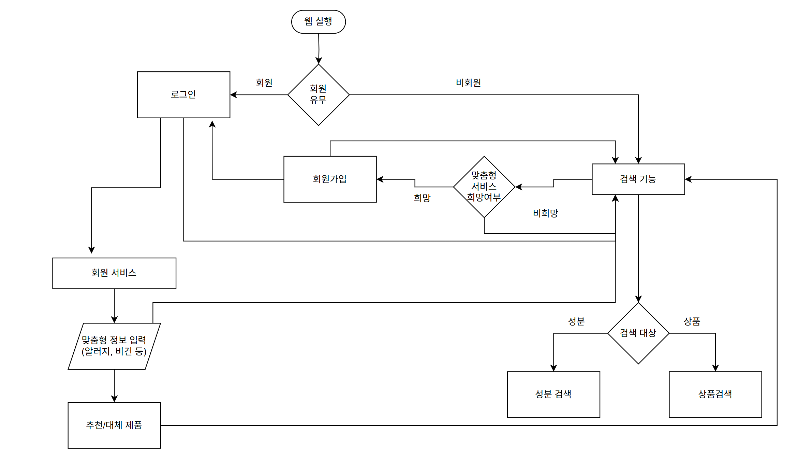
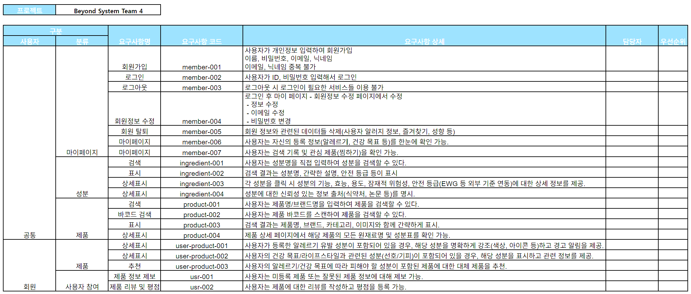
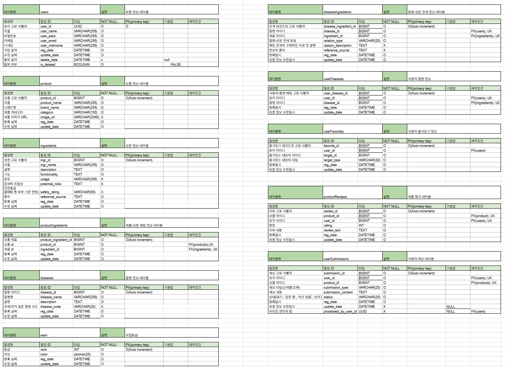
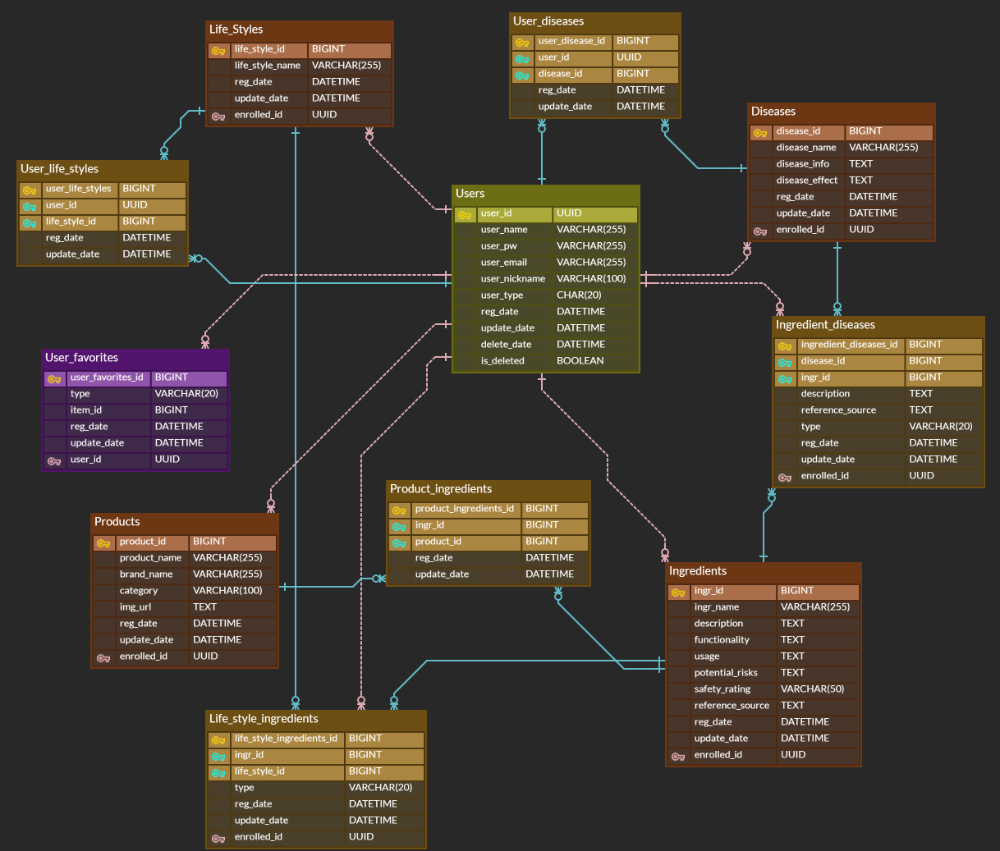

# 목차
- [시스템 흐름도](#시스템-흐름도)
- [기능 명세서](#기능-명세서)
- [테이블-정의서](#테이블-정의서)
- [DDL](#ddl)  
- [DML](#dml)


# 시스템 흐름도


# 기능 명세서


# 테이블 정의서


# ERD



# DDL
<details>
	<summary>사용자 테이블</summary>

```SQL
-- 사용자 테이블
CREATE TABLE `users`(
	`user_id` UUID DEFAULT UUID() COMMENT '사용자 고유 ID',
	`user_name` VARCHAR(255) NOT NULL COMMENT '사용자 이름',
	`user_pw` VARCHAR(255) NOT NULL COMMENT '사용자 비밀번호',
	`user_email` VARCHAR(255) NOT NULL COMMENT '사용자 이메일',
	`user_nickname` VARCHAR(100) NOT NULL COMMENT '사용자 닉네임', 
	`user_type` CHAR(20) NOT NULL DEFAULT 'user' COMMENT '사용자 유형(user/manager)',
	`reg_date` DATETIME NOT NULL DEFAULT CURRENT_TIMESTAMP COMMENT '가입 일자',
	`update_date` DATETIME NOT NULL DEFAULT CURRENT_TIMESTAMP ON UPDATE CURRENT_TIMESTAMP COMMENT '수정 일자',
	`delete_date` DATETIME COMMENT '탈퇴 일자',
	`is_deleted` BOOLEAN NOT NULL DEFAULT FALSE COMMENT '탈퇴 여부',
	
	-- 제약 조건
	CONSTRAINT PRIMARY KEY (user_id),
	CONSTRAINT uq_user_email UNIQUE (user_email),
	CONSTRAINT uq_user_nickname UNIQUE (user_nickname),
	CONSTRAINT chk_user_type CHECK (`user_type` IN ('user', 'manager'))
);
```
</details>

<details>
	<summary>제품 테이블</summary>

```SQL
-- 제품 테이블
CREATE TABLE `products`(
	`product_id` BIGINT AUTO_INCREMENT COMMENT '제품 ID',
	`product_name` VARCHAR(255) NOT NULL COMMENT '제품 이름',
	`brand_name` VARCHAR(255) COMMENT '브랜드',
	`category` VARCHAR(100) NOT NULL COMMENT '카테고리',
	`img_url` TEXT COMMENT '제품 이미지', 
	`enrolled_id` UUID NOT NULL COMMENT '관리자 아이디',
	`reg_date` DATETIME NOT NULL DEFAULT CURRENT_TIMESTAMP COMMENT '등록 일자',
	`update_date` DATETIME NOT NULL DEFAULT CURRENT_TIMESTAMP ON UPDATE CURRENT_TIMESTAMP COMMENT '수정 일자',
	
	-- 제약 조건
	CONSTRAINT PRIMARY KEY (product_id),
	CONSTRAINT fk_products_enrolled_id FOREIGN KEY (enrolled_id) REFERENCES users(user_id)
);
```
</details>

<details>
	<summary>성분 테이블</summary>

```SQL
-- 성분 테이블
CREATE TABLE `ingredients`(
	`ingr_id` BIGINT AUTO_INCREMENT COMMENT '성분 ID',
	`ingr_name` VARCHAR(255) NOT NULL COMMENT '성분 이름',
	`description` TEXT COMMENT '설명',
	`functionality` TEXT NOT NULL COMMENT '기능',
	`usage` TEXT COMMENT '용도',
	`potential_risks` TEXT COMMENT '잠재적 위험성',
	`safety_rating` VARCHAR(50) COMMENT '안전 등급',
	`reference_source` TEXT NOT NULL COMMENT '정보출처',
	`enrolled_id` UUID NOT NULL COMMENT '관리자 아이디',
	`reg_date` DATETIME NOT NULL DEFAULT CURRENT_TIMESTAMP COMMENT '등록 일자',
	`update_date` DATETIME NOT NULL DEFAULT CURRENT_TIMESTAMP ON UPDATE CURRENT_TIMESTAMP COMMENT '수정 일자',
	
	-- 제약 조건
	CONSTRAINT PRIMARY KEY (ingr_id),
	CONSTRAINT fk_ingredients_enrolled_id FOREIGN KEY (enrolled_id) REFERENCES users(user_id)
);
```
</details>

<details>
	<summary>질병 테이블</summary>

```SQL
-- 질병 테이블
CREATE TABLE `diseases`(
	`disease_id` BIGINT AUTO_INCREMENT COMMENT '질병 ID',
	`disease_name` VARCHAR(255) NOT NULL COMMENT '질병 이름',
	`disease_info` TEXT COMMENT '질병 정보',
	`disease_effect` TEXT COMMENT '증상',
	`enrolled_id` UUID NOT NULL COMMENT '관리자 아이디',
	`reg_date` DATETIME NOT NULL DEFAULT CURRENT_TIMESTAMP COMMENT '등록 일자',
	`update_date` DATETIME NOT NULL DEFAULT CURRENT_TIMESTAMP ON UPDATE CURRENT_TIMESTAMP COMMENT '수정 일자',
	
	-- 제약 조건
	CONSTRAINT PRIMARY KEY (disease_id),
	CONSTRAINT fk_diseases_enrolled_id FOREIGN KEY (enrolled_id) REFERENCES users(user_id)
);
```
</details>

<details>
	<summary>라이프스타일 테이블</summary>

```SQL
-- 라이프 스타일 테이블
CREATE TABLE `life_styles`(
	`life_style_id` BIGINT AUTO_INCREMENT COMMENT '라이프 스타일 ID',
	`life_style_name` VARCHAR(255) NOT NULL COMMENT '라이프 스타일 이름',
	`enrolled_id` UUID NOT NULL COMMENT '관리자 아이디',
	`reg_date` DATETIME NOT NULL DEFAULT CURRENT_TIMESTAMP COMMENT '등록 일자',
	`update_date` DATETIME NOT NULL DEFAULT CURRENT_TIMESTAMP ON UPDATE CURRENT_TIMESTAMP COMMENT '수정 일자',
	
	-- 제약 조건
	CONSTRAINT PRIMARY KEY (life_style_id),
	CONSTRAINT fk_life_styles_enrolled_id FOREIGN KEY (enrolled_id) REFERENCES users(user_id)
);
```
</details>

<details>
	<summary>제품 성분 관계 테이블</summary>

```SQL
-- 제품 성분 관계 테이블
CREATE TABLE `product_ingredients`(
	`product_ingredients_id` BIGINT AUTO_INCREMENT NOT NULL COMMENT ' 제품 성분 ID',
	`product_id` BIGINT NOT NULL COMMENT '제품 ID',
	`ingr_id` BIGINT NOT NULL COMMENT '성분 ID',
	`enrolled_id` UUID NOT NULL COMMENT '관리자 아이디',
	`reg_date` DATETIME NOT NULL DEFAULT CURRENT_TIMESTAMP COMMENT '등록 일자',
	`update_date` DATETIME NOT NULL DEFAULT CURRENT_TIMESTAMP ON UPDATE CURRENT_TIMESTAMP COMMENT '수정 일자',
	
	-- 제약 조건
	CONSTRAINT PRIMARY KEY (product_ingredients_id),
	CONSTRAINT uq_product_ingredient UNIQUE (product_id, ingr_id),
	CONSTRAINT fk_product_ingredients_enrolled_id FOREIGN KEY (enrolled_id) REFERENCES users(user_id),
	CONSTRAINT fk_product_ingredients_ingr_id FOREIGN KEY (ingr_id) REFERENCES ingredients(ingr_id),
	CONSTRAINT fk_product_ingredients_product_id FOREIGN KEY (product_id) REFERENCES products(product_id)
);
```
</details>

<details>
	<summary>성분 질병 관계 테이블</summary>

```SQL
-- 성분 질병 관계 테이블
CREATE TABLE `ingredient_diseases`(
	`ingredient_diseases_id` BIGINT AUTO_INCREMENT NOT NULL COMMENT ' 성분 질병 ID',
	`ingr_id` BIGINT NOT NULL COMMENT '성분 ID',
	`disease_id` BIGINT NOT NULL COMMENT '질병 ID',
	`description`TEXT COMMENT '설명',
	`reference_source` TEXT COMMENT '출처',
	`type` VARCHAR(20) NOT NULL COMMENT '성분 질병 관계(good/bad)',
	`enrolled_id` UUID NOT NULL COMMENT '관리자 아이디',
	`reg_date` DATETIME NOT NULL DEFAULT CURRENT_TIMESTAMP COMMENT '등록 일자',
	`update_date` DATETIME NOT NULL DEFAULT CURRENT_TIMESTAMP ON UPDATE CURRENT_TIMESTAMP COMMENT '수정 일자',
	
	-- 제약 조건
	CONSTRAINT PRIMARY KEY (ingredient_diseases_id),
	CONSTRAINT uq_ingredient_diseases UNIQUE (ingr_id, diseases_id),
	CONSTRAINT fk_ingredient_diseases_enrolled_id FOREIGN KEY (enrolled_id) REFERENCES users(user_id),
	CONSTRAINT fk_ingredient_diseases_ingr_id FOREIGN KEY (ingr_id) REFERENCES ingredients(ingr_id),
	CONSTRAINT fk_ingredient_diseases_disease_id FOREIGN KEY (disease_id) REFERENCES diseases(disease_id),
	CONSTRAINT chk_ingredient_diseases_type CHECK (`type` IN ('good', 'bad'))
);
```
</details>

<details>
	<summary>라이프스타일 성분 관계 테이블</summary>

```SQL
-- 라이프스타일 성분 관계 테이블
CREATE TABLE `life_style_ingredients`(
	`life_style_ingredients_id` BIGINT AUTO_INCREMENT NOT NULL COMMENT ' 라이프스타일 성분 ID',
	`life_style_id` BIGINT NOT NULL COMMENT '라이프스타일 ID',
	`ingr_id` BIGINT NOT NULL COMMENT '성분 ID',
	`type` VARCHAR(20) NOT NULL COMMENT '라이프스타일 성분 관계(good/bad)',
	`enrolled_id` UUID NOT NULL COMMENT '관리자 아이디',
	`reg_date` DATETIME NOT NULL DEFAULT CURRENT_TIMESTAMP COMMENT '등록 일자',
	`update_date` DATETIME NOT NULL DEFAULT CURRENT_TIMESTAMP ON UPDATE CURRENT_TIMESTAMP COMMENT '수정 일자',
	
	-- 제약 조건
	CONSTRAINT PRIMARY KEY (life_style_ingredients_id),
	CONSTRAINT uq_life_style_ingredients UNIQUE (ingr_id, life_style_id),
	CONSTRAINT fk_life_style_ingredients_life_style_id FOREIGN KEY (life_style_id) REFERENCES life_styles(life_style_id),
	CONSTRAINT fk_life_style_ingredients_ingr_id FOREIGN KEY (ingr_id) REFERENCES ingredients(ingr_id),
	CONSTRAINT fk_life_style_ingredients_enrolled_id FOREIGN KEY (enrolled_id) REFERENCES users(user_id),
	CONSTRAINT chk_life_style_ingredients_type CHECK (`type` IN ('good', 'bad'))
);
```
</details>

<details>
	<summary>사용자 질병 관계 테이블</summary>

```SQL
-- 사용자 질병 관계 테이블
CREATE TABLE `user_diseases`(
	`user_diseases_id` BIGINT AUTO_INCREMENT NOT NULL COMMENT ' 사용자 질병 ID',
	`user_id` UUID NOT NULL COMMENT '사용자 ID',
	`disease_id` BIGINT NOT NULL COMMENT '질병 ID',
	`reg_date` DATETIME NOT NULL DEFAULT CURRENT_TIMESTAMP COMMENT '등록 일자',
	`update_date` DATETIME NOT NULL DEFAULT CURRENT_TIMESTAMP ON UPDATE CURRENT_TIMESTAMP COMMENT '수정 일자',
	
	-- 제약 조건
	CONSTRAINT PRIMARY KEY (user_diseases_id),
	CONSTRAINT uq_user_diseases UNIQUE (user_id, diseases_id),
	CONSTRAINT fk_user_diseases_user_id FOREIGN KEY (user_id) REFERENCES users(user_id),
	CONSTRAINT fk_user_diseases_diseases_id FOREIGN KEY (disease_id) REFERENCES diseases(disease_id)
);
```
</details>

<details>
	<summary>사용자 라이프스타일 관계 테이블</summary>

```SQL
-- 사용자 라이프스타일 관계 테이블
CREATE TABLE `user_life_styles`(
	`user_life_styles_id` BIGINT AUTO_INCREMENT NOT NULL COMMENT ' 사용자 라이프스타일 ID',
	`user_id` UUID NOT NULL COMMENT '사용자 ID',
	`life_style_id` BIGINT NOT NULL COMMENT '라이프스타일 ID',
	`reg_date` DATETIME NOT NULL DEFAULT CURRENT_TIMESTAMP COMMENT '등록 일자',
	`update_date` DATETIME NOT NULL DEFAULT CURRENT_TIMESTAMP ON UPDATE CURRENT_TIMESTAMP COMMENT '수정 일자',
	
	-- 제약 조건
	CONSTRAINT PRIMARY KEY (user_life_styles_id),
	CONSTRAINT fk_user_life_styles_users_id FOREIGN KEY (user_id) REFERENCES users(user_id),
	CONSTRAINT fk_user_life_styles_life_style FOREIGN KEY (life_style_id) REFERENCES life_styles(life_style_id)
);
```
</details>

<details>
	<summary>사용자 즐겨찾기 테이블</summary>

```SQL
-- 사용자 즐겨찾기 테이블
CREATE TABLE `user_favorites`(
	`user_favorites_id` BIGINT AUTO_INCREMENT NOT NULL COMMENT ' 사용자 즐겨찾기 ID',
	`user_id` UUID NOT NULL COMMENT '사용자 ID',
	`type` VARCHAR(20) NOT NULL COMMENT '즐겨찾기한 대상',
	`item_id` BIGINT NOT NULL COMMENT '즐겨찾기 대상 ID',
	`reg_date` DATETIME NOT NULL DEFAULT CURRENT_TIMESTAMP COMMENT '등록 일자',
	`update_date` DATETIME NOT NULL DEFAULT CURRENT_TIMESTAMP ON UPDATE CURRENT_TIMESTAMP COMMENT '수정 일자',
	
	-- 제약 조건
	CONSTRAINT PRIMARY KEY (user_favorites_id),
	CONSTRAINT fk_user_favorites_users_id FOREIGN KEY (user_id) REFERENCES users(user_id),
	CONSTRAINT ck_user_favorites_type CHECK (`type` IN ('products', 'ingredients', 'diseases'))
);
```
</details>

# DML
<details>
	<summary>회원가입</summary>

```SQL
-- 회원 가입 member-001
DELIMITER $$
CREATE PROCEDURE createAccountProc(
	IN `in_userName` VARCHAR(255),
	IN `in_userPassword` VARCHAR(255),
	IN `in_userNickname` VARCHAR(100),
	IN `in_userEmail` VARCHAR(255),
	OUT `out_result` BOOLEAN
)
BEGIN
	DECLARE `userID` UUID;
	DECLARE `delYN` BOOLEAN FALSE;
	
	SET out_result = TRUE;
	
	SELECT user_id, is_deleted INTO userID, delYN
	FROM `users`
	WHERE `user_nickname` = in_userNickname;
	
	-- 아이디가 존재하는 경우
	IF userID IS NOT NULL THEN
		-- 기존 유저
		IF delYN = TRUE THEN
			UPDATE `users` SET
			    `is_deleted` = FALSE,
			    `delete_date` = NULL,
			    `user_pw` = in_userPassword,
			    `user_name` = in_userName,
			    `user_email` = in_userEmail
			WHERE
			    `user_id` = userID;
			SET out_result = TRUE;
		ELSE
			SET out_result = FALSE;		
		END IF;
	ELSE
		INSERT INTO `users`(
			`user_nickname`,
			`user_pw`,
			`user_name`,
			`user_email`
		) VALUES(
			in_userNickname,
			in_userPassword,
			in_userName,
			in_userEmail
		);
		SET out_result = TRUE;
	END IF;
END $$
DELIMITER ;
```
</details>

<details>
	<summary>로그인</summary>

```SQL
-- 로그인 member-002
DELIMITER $$
CREATE PROCEDURE loginAccountProc(
	IN `in_userNickname` VARCHAR(255),
	IN `in_userPassword` VARCHAR(255),
	OUT `out_id` UUID,
	OUT `out_result` BOOLEAN
)
BEGIN
	DECLARE `userID` UUID;
	DECLARE `delYN` BOOLEAN FALSE;
	
	SET out_result = TRUE;
	
	SELECT user_id, is_deleted INTO userID, delYN
	FROM `users`
	WHERE (`user_nickname` = in_userNickname)
		AND (`user_pw` = in_userPassword);
	
	IF userID IS NOT NULL THEN
		IF delYN = FALSE THEN
			SET out_id = userID;
		ELSE
			SET out_result = FALSE;
		END IF;
	ELSE
		SET out_result = FALSE;
	END IF;
	
END $$
DELIMITER ;
```
</details>

<details>
	<summary>회원 정보 수정</summary>

```SQL
-- 회원 정보 수정 member-004
DELIMITER $$
CREATE PROCEDURE updateAccountProc(
	IN `in_userNickname` VARCHAR(255),
	IN `in_userPassword` VARCHAR(255),
	IN `in_userName` VARCHAR(100),
	IN `in_userEmail` VARCHAR(255),
	OUT `out_result` BOOLEAN
)
BEGIN
	DECLARE `userID` UUID;
	DECLARE `delYN` BOOLEAN FALSE;
	
	SET out_result = FALSE;
	
	UPDATE `users` SET
		`user_pw` = in_userPassword,
		`user_name` = in_userName,
		`user_email` = in_userEmail
	WHERE
		`user_nickname` = in_userNickname AND `is_deleted` = FALSE;
	
	IF ROW_COUNT() > 0 THEN
		SET out_result = TRUE;
	ELSE

		SET out_result = FALSE; 
	END IF;
END $$
DELIMITER ;
```
</details>

<details>
	<summary>회원 탈퇴</summary>

```SQL
-- 회원 탈퇴 member-005
DELIMITER $$
CREATE PROCEDURE deleteAccountProc(
	IN `in_userID` UUID
)
BEGIN
	SET out_result = FALSE;
	
	UPDATE `users`
	SET
		`is_deleted` = TRUE,
	   `delete_date` = CURRENT_TIMESTAMP
	WHERE `user_id` = in_userID AND `is_deleted` = FALSE;

	IF ROW_COUNT() > 0 THEN
		SET out_result = TRUE;
	ELSE
	   SET out_result = FALSE;
	END IF;
END $$
DELIMITER ;
```
</details>

<details>
	<summary>마이페이지(등록 정보)</summary>

```SQL
-- 마이페이지 (등록 정보) member-006
DELIMITER $$
CREATE PROCEDURE getEnrolledProc(
	IN `in_userID` UUID
)
BEGIN
	SELECT
		user_name
		, user_email
	FROM `users`
	WHERE user_id = in_userID;

	SELECT
		disease_id
	FROM `user_diseases`
	WHERE user_id = in_userID;
	
	SELECT
		life_style_id
	FROM `user_life_styles`
	WHERE user_id = in_userID;
END $$
DELIMITER ;
```
</details>

<details>
	<summary>마이페이지(즐겨찾기)</summary>

```SQL
-- 마이페이지 (즐겨찾기) member-007
DELIMITER $$
CREATE PROCEDURE getFavoritesProc(
	IN `in_userID` UUID
)
BEGIN

	-- 제품 즐겨찾기 조회
	SELECT
		uf.item_id
		, uf.item_type AS '종류'
		, p.product_name AS '대상'
	FROM `user_favorites` AS uf
	INNER JOIN `products` AS p
		ON uf.item_id = p.product_id
	WHERE uf.user_id = in_userID
	  AND uf.item_type = 'product'

	UNION ALL

	-- 성분 즐겨찾기 조회
	SELECT
		uf.item_id
		, uf.item_type AS '종류'
		, i.ingr_name AS '대상'
	FROM `user_favorites` AS uf
	INNER JOIN `ingredients` AS i
		ON uf.item_id = i.ingr_id
	WHERE uf.user_id = in_userID
	  AND uf.item_type = 'ingredient'

	UNION ALL

	-- 질병 즐겨찾기 조회
	SELECT
		uf.item_id
		, uf.item_type AS '종류'
		, d.disease_name AS '대상'
	FROM `user_favorites` AS uf
	INNER JOIN `diseases` AS d
		ON uf.item_id = d.disease_id
	WHERE uf.user_id = in_userID
	  AND uf.item_type = 'disease';

END $$
DELIMITER ;
```
</details>

<details>
	<summary>성분 검색</summary>

```SQL
-- 성분 검색 ingredient-001,2,3,4
DELIMITER $$
CREATE PROCEDURE getIngrProc(
	IN `in_search`VARCHAR(255)
)
BEGIN
	SELECT
		i.`ingr_id`
		, i.`ingr_name`
		, i.`description`
		, i.`functionality`
		, i.`usage`
		, i.`potential_risks`
		, i.`safety_rating`
		, i.`reference_source`
		, id.`disease_id`
		, d.`disease_name`
		, id.`enrolled_id`
		, id.`reg_date`
		, id.`update_date`
	FROM ingredients AS i
	LEFT JOIN ingredient_diseases AS id
		ON i.ingr_id = id.ingr_id
	LEFT JOIN diseases AS d
		ON d.disease_id = id.disease_id
	WHERE ingr_name LIKE CONCAT('%', in_search, '%');
END $$
DELIMITER ;
```
</details>

<details>
	<summary>제품 검색</summary>

```SQL
-- 제품 검색 product-001,2,3,4
DELIMITER $$
CREATE PROCEDURE getProductProc(
	IN `in_search`VARCHAR(255),
	IN `in_type` VARCHAR(20)
)
BEGIN

	SELECT
		p.`product_id`
		, p.`product_name`
		, p.`brand_name`
		, p.`category`
		, p.`img_url`
		, i.`ingr_name`
		, pri.`enrolled_id`
		, pri.`reg_date`
		, pri.`update_date`
	FROM products AS p
	LEFT JOIN product_ingredients AS pri
		ON p.product_id = pri.product_id
	LEFT JOIN ingredients AS i
		ON i.ingr_id = pri.ingr_id
	WHERE
		(
			in_type = 'name' AND p.product_name LIKE CONCAT('%', in_search, '%')
		) OR (
			in_type = 'brand' AND p.brand_name LIKE CONCAT('%', in_search, '%')
		) OR (
			in_type NOT IN ('name', 'brand') AND (
				p.product_name LIKE CONCAT('%', in_search, '%')
				OR p.brand_name LIKE CONCAT('%', in_search, '%')
			)
		);
END $$
DELIMITER ;
```
</details>

<details>
	<summary>질환 검색</summary>

```SQL
-- 질환 검색 disease-001,2
DELIMITER $$
CREATE PROCEDURE getDiseasesProc(
	IN `in_search`VARCHAR(255)
)
BEGIN
	SELECT
		d.`disease_name`
		, d.`disease_info`
		, d.`disease_effect`
		, id.`ingr_id`
		, i.`ingr_name`
		, id.`description`
		, id.`reference_source`
		, id.`type`
		, id.`enrolled_id`
		, id.`reg_date`
		, id.`update_date`
	FROM diseases AS d
	LEFT JOIN ingredient_diseases AS id
		ON d.disease_id = id.disease_id
	LEFT JOIN ingredients AS i
		ON i.ingr_id = id.ingr_id
	WHERE disease_name LIKE CONCAT('%', in_search, '%');
END $$
DELIMITER ;
```
</details>

<details>
	<summary>위험 표시</summary>

```SQL
-- 위험 표시 user-product-001
DELIMITER $$
CREATE PROCEDURE getProductDiseaseDetailsProc(
	IN `in_userID` UUID,
	IN `in_product`BIGINT
)
BEGIN
	
	SELECT
		p.`product_name`
		, i.`ingr_name`
		, pri.`product_id`
		, i.`ingr_id`
		, i.`description` AS ingr_description
		, i.`functionality`
		, i.`usage`
		, i.`potential_risks`
		, i.`safety_rating`
		, i.`reference_source`
		, id.`type` AS disease_relation_type
		, d.`disease_name`
		, d.`disease_info`
		, d.`disease_effect`
	FROM `product_ingredients` AS pri
	INNER JOIN `products` AS p
		ON p.product_id = pri.product_id
	INNER JOIN `ingredients` AS i
		ON i.ingr_id = pri.ingr_id
	LEFT JOIN `ingredient_diseases` AS id
		ON i.ingr_id = id.ingr_id
	LEFT JOIN `diseases` AS d
		ON d.disease_id = id.disease_id
	LEFT JOIN `user_diseases` AS ud
		ON ud.disease_id = d.disease_id
	WHERE pri.product_id = in_product;
	
	-- 로그인 시 내 질병과 관련 되어있는 성분반환
	IF in_userID IS NOT NULL THEN
		SELECT
			i.`ingr_name`
			, id.`type` AS `user_disease_relation_type`
			, d.`disease_name`
		FROM `product_ingredients` AS pri
		INNER JOIN `ingredients` AS i
			ON i.ingr_id = pri.ingr_id
		INNER JOIN `ingredient_diseases` AS id
			ON i.ingr_id = id.ingr_id
		INNER JOIN `diseases` AS d
			ON d.disease_id = id.disease_id
		INNER JOIN `user_diseases` AS ud
			ON ud.disease_id = d.disease_id
		WHERE pri.product_id = in_product
			AND ud.user_id = in_userID;
	END IF;
END $$
DELIMITER ;
```
</details>

<details>
	<summary>사용자 라이프스타일 위험표시</summary>

```SQL
-- 사용자 라이프 스타일 위험 표시 user-product-002
DELIMITER $$
CREATE PROCEDURE getLifeStyleIngredientsDetailsProc(
	IN `in_userID` UUID
)
BEGIN
	
	IF in_userID IS NOT NULL THEN
		SELECT 
			i.ingr_id
			, i.ingr_name
			, l.life_style_name
		FROM ingredients AS i
		INNER JOIN life_style_ingredients AS li
			ON i.ingr_id = li.ingr_id
		INNER JOIN life_styles AS l
			ON li.life_style_id = l.life_style_id
		INNER JOIN user_life_styles AS ul
			ON li.life_style_id = ul.life_style_id
		WHERE ul.user_id = in_userID;
	END IF;
END $$
DELIMITER ;
```
</details>

<details>
	<summary>추천</summary>

```SQL
-- 추천 user-product-003
DELIMITER $$
CREATE PROCEDURE getRecommandProc(
	IN `in_userID` UUID
)
BEGIN
	SELECT
		d.disease_name
		, i.ingr_name
	FROM `ingredients` AS i
	INNER JOIN ingredient_diseases AS id
		ON i.`ingr_id` = id.`ingr_id`
	INNER JOIN diseases AS d
		ON d.disease_id = id.disease_id
	INNER JOIN user_diseases AS ud
		ON id.disease_id = ud.disease_id
	WHERE ud.user_id = in_userID
		AND id.`type` = 'good';
		
	SELECT
		l.life_style_name
		, i.ingr_name
	FROM `ingredients` AS i
	INNER JOIN life_style_ingredients AS li
		ON i.`ingr_id` = li.`ingr_id`
	INNER JOIN life_styles AS l
		ON l.life_style_id = li.life_style_id
	INNER JOIN user_life_styles AS ul
		ON li.life_style_id = ul.life_style_id
	WHERE ul.user_id = in_userID
		AND li.`type` = 'good';
END $$
DELIMITER ;
```
</details>

# 회고록
> **임승택** : 서비스의 기획부터 DB 구현까지 전반적으로 모든 활동을 해보면서 실제 업무의 흐름을 경험 할 수있어서 좋았다. ERD를 그려보며 테이블 간의 관계를 확실히 이해할 수 있었고 요구사항, 테이블 명세서 등 먼저 구성을 하고 작업을 하니 명확하게 작업을 할 수 있다는 것을 알게 되었다.